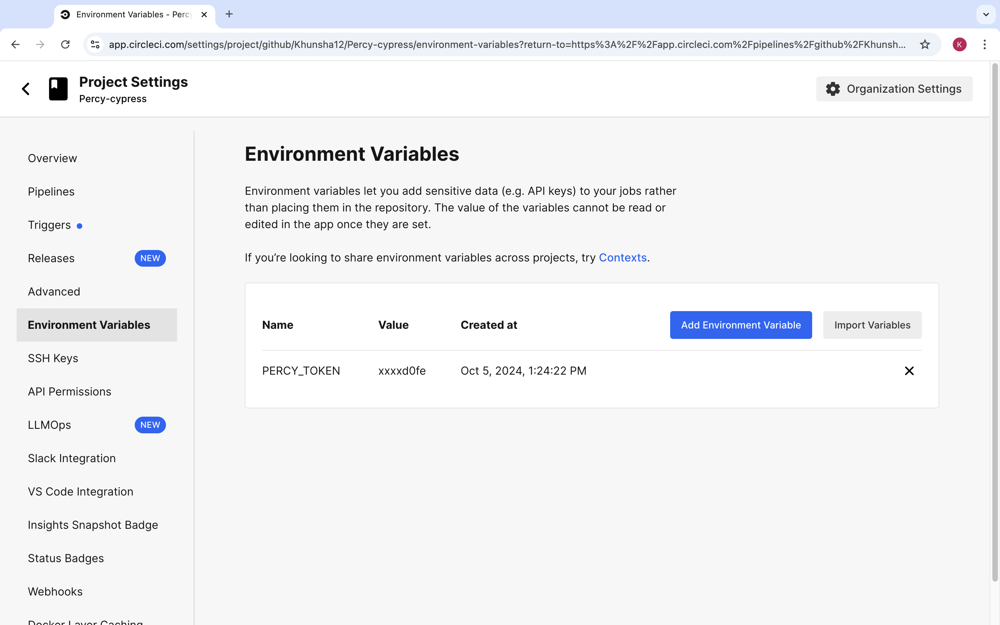

### Setting Up CircleCI Integration with Percy and Cypress

1. Log in to [CircleCI](https://circleci.com/) using your GitHub account.  
2. Set up your project in CircleCI and ensure that the `.circleci/config.yml` file exists in the root directory of your project.  
3. Go to your project settings in CircleCI and add the Percy token as an environment variable:  
   - Navigate to **Project Settings > Environment Variables**.  
   - Add a new variable with the name `PERCY_TOKEN` and paste your token as the value.  

   
4. Whenever you commit any changes to your project, the CircleCI pipeline will automatically be triggered.
